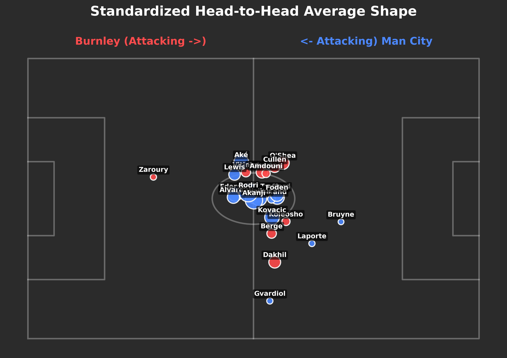

# xAssassin - Premier League Analytics Suite

A comprehensive football analytics platform for visualizing and analyzing Premier League match data. Features tactical formation detection, pass networks, shot-creating actions, expected threat analysis, and AI-powered match summaries.



---

## Features

- **Pass Maps** - Visualize every successful pass across a match or full season
- **Shot-Creating Actions (SCA)** - Identify players who engineer the most dangerous chances
- **Expected Threat (xT)** - Measure ball progression into high-value zones
- **Match Summary** - Full event breakdown with shot map and momentum chart
- **Team Comparison** - Compare two squads across passing, chance creation, and threat
- **Average Touches** - Standardized player positioning heatmap with touch counts
- **Formation Analyzer** - AI-powered tactical formation detection and analysis

---

## Tech Stack

| Layer | Technology |
|-------|------------|
| Frontend | React 18 (CDN), Babel Standalone, GSAP |
| Backend | Flask (Python) |
| Dashboard | Streamlit |
| Database | Supabase |
| AI | Google Gemini API |
| Styling | Custom CSS (Editorial Theme) |

---

## Project Structure

```
SoccerStats/
│
├── web/                          # React Frontend (Flask-served)
│   ├── server.py                 # Flask server with API endpoints
│   ├── templates/
│   │   └── index.html            # HTML entry point with CDN scripts
│   └── static/
│       ├── css/
│       │   └── styles.css        # Editorial theme styles
│       └── js/
│           ├── app.jsx           # Main React application
│           ├── core/             # Core utilities
│           │   ├── constants.js      # NAV_ITEMS, colors, dimensions
│           │   ├── hooks/
│           │   │   └── useRoute.js   # Hash-based routing hook
│           │   └── utils/
│           │       ├── api.js        # API fetch wrapper
│           │       └── coordinates.js # Opta coordinate transforms
│           ├── components/       # Reusable UI components
│           │   ├── canvas/
│           │   │   ├── DataFieldHero.jsx    # Animated landing hero
│           │   │   ├── PitchComponents.jsx  # SVG pitch, markings, arrows
│           │   │   └── RadarChart.jsx       # Spider chart visualization
│           │   ├── common/
│           │   │   └── BaseComponents.jsx   # Loading, EmptyState, etc.
│           │   ├── icons/
│           │   │   └── Icons.jsx            # SVG icon components
│           │   └── layout/
│           │       └── Layout.jsx           # Header, Nav, PageTransition
│           └── features/         # Feature-based modules (barrel exports)
│               ├── AverageTouches/
│               ├── ExpectedThreat/
│               ├── Home/
│               ├── MatchSummary/
│               ├── PassMaps/
│               ├── ShotCreatingActions/
│               ├── TeamComparison/
│               └── index.js
│
├── dashboard/                    # Streamlit Dashboard
│   ├── app.py                    # Main Streamlit entry
│   ├── config.py                 # Shared config (colors, Supabase)
│   └── pages/
│       ├── 1_🎯_Pass_Maps.py
│       ├── 2_⚡_SCA.py
│       ├── 3_🔥_Expected_Threat.py
│       ├── 4_📊_Match_Summary.py
│       ├── 5_⚔️_Team_Comparison.py
│       ├── 6_average_touches.py
│       └── 6b_enhanced_average_shape.py
│
├── xAssassin/                    # Core Analytics Library
│   ├── __init__.py
│   ├── metrices.py               # TacticalEngine - xT, SCA calculations
│   ├── formation_analyzer.py     # AI formation detection
│   ├── bulk_harvester.py         # Data collection utilities
│   └── upload_to_cloud.py        # Supabase upload script
│
├── scripts/                      # Utility Scripts
│   ├── formation_examples.py     # Example formation patterns
│   ├── run_formation_analysis.py # CLI for formation analysis
│   ├── setup_ai.sh               # AI setup automation
│   └── test_engine.py            # TacticalEngine test suite
│
├── docs/                         # Documentation
│   ├── AI_SUMMARY_COMPLETE.md
│   ├── FORMATION_ANALYZER_DOCS.md
│   ├── IMPLEMENTATION_REFERENCE.md
│   ├── README_FORMATION_ANALYZER.md
│   ├── SETUP_AI_SUMMARY.md
│   └── SUMMARY.md
│
├── assets/                       # Static Assets
│   └── split_pitch_shape.png
│
├── output/                       # Generated Outputs
│   └── formations/
│       └── *.png                 # Formation visualizations
│
├── data/                         # Match Data (gitignored)
│   └── *.json
│
├── .env                          # Environment variables (gitignored)
├── .env.example                  # Environment template
├── .gitignore
├── requirements.txt
└── readme.md
```

---

## Quick Start

### 1. Clone the Repository

```bash
git clone https://github.com/hritikshuklalfc/xAssassin.git
cd xAssassin
```

### 2. Set Up Virtual Environment

```bash
python3 -m venv .venv
source .venv/bin/activate  # macOS/Linux
# or
.venv\Scripts\activate     # Windows
```

### 3. Install Dependencies

```bash
pip install -r requirements.txt
```

### 4. Configure Environment Variables

```bash
cp .env.example .env
```

Edit `.env` with your credentials:

```env
GEMINI_API_KEY=your_gemini_api_key_here
SUPABASE_URL=your_supabase_url_here
SUPABASE_KEY=your_supabase_key_here
```

### 5. Run the Application

**React Frontend (Flask):**
```bash
python web/server.py
# Open http://localhost:5050
```

**Streamlit Dashboard:**
```bash
streamlit run dashboard/app.py
# Open http://localhost:8501
```

---

## API Endpoints

| Endpoint | Description |
|----------|-------------|
| `GET /api/matches` | List all match IDs |
| `GET /api/match-index` | Get match metadata (season, teams, date) |
| `GET /api/teams` | List all teams |
| `GET /api/match/<id>/events` | Get all events for a match |
| `GET /api/match/<id>/passes` | Get passes for a match |
| `GET /api/match/<id>/shots` | Get shots for a match |
| `GET /api/match/<id>/sca` | Get shot-creating actions |
| `GET /api/match/<id>/xt` | Get expected threat data |
| `GET /api/match/<id>/average-positions` | Get player average positions |
| `GET /api/match/<id>/formation` | Get detected formation |
| `GET /api/match/<id>/ai-summary` | Get AI-generated match summary |
| `GET /api/team/<name>/passes` | Get all passes for a team |

---

## Key Components

### TacticalEngine (`xAssassin/metrices.py`)

Core analytics engine that calculates:
- **Expected Threat (xT)** - Ball progression value based on pitch zones
- **Shot-Creating Actions (SCA)** - Two actions preceding each shot
- **Pass Networks** - Aggregated passing connections

### Formation Analyzer (`xAssassin/formation_analyzer.py`)

AI-powered formation detection using:
- K-means clustering for player positioning
- Template matching against known formations
- Gemini AI for tactical analysis summaries

### React Components

| Component | Location | Purpose |
|-----------|----------|---------|
| `DataFieldHero` | `components/canvas/` | Animated pitch with drifting players |
| `PitchSVG` | `components/canvas/` | Reusable SVG pitch container |
| `PassArrows` | `components/canvas/` | Pass visualization with arrows |
| `RadarChart` | `components/canvas/` | Team comparison spider charts |
| `SiteHeader` | `components/layout/` | Sticky header with navigation |
| `NavOverlay` | `components/layout/` | Full-screen navigation menu |

---

## Environment Variables

| Variable | Description | Required |
|----------|-------------|----------|
| `GEMINI_API_KEY` | Google Gemini API key for AI summaries | Yes (for AI features) |
| `SUPABASE_URL` | Supabase project URL | Yes (for cloud data) |
| `SUPABASE_KEY` | Supabase anon/public key | Yes (for cloud data) |
| `FLASK_PORT` | Flask server port (default: 5050) | No |
| `FLASK_DEBUG` | Enable debug mode | No |

---

## Data Sources

Match data is sourced from WhoScored and stored locally in JSON format:
- `data/matches/` - Raw match event data
- `data/processed/` - Computed metrics (xT, SCA)

---

## Screenshots

### Landing Page
Editorial-style landing with animated pitch visualization and tool previews.

### Pass Maps
Interactive pass network visualization with player filtering.

### Formation Analysis
AI-detected formations with tactical summaries.

---

## Contributing

1. Fork the repository
2. Create a feature branch (`git checkout -b feature/amazing-feature`)
3. Commit your changes (`git commit -m 'Add amazing feature'`)
4. Push to the branch (`git push origin feature/amazing-feature`)
5. Open a Pull Request

---

## License

This project is for educational and personal use only. Match data belongs to its respective owners.

---

## Author

**Hritik Shukla** - [GitHub](https://github.com/hritikshuklalfc)

---

## Acknowledgments

- WhoScored for match data
- StatsBomb for xT model inspiration
- Google Gemini for AI capabilities
